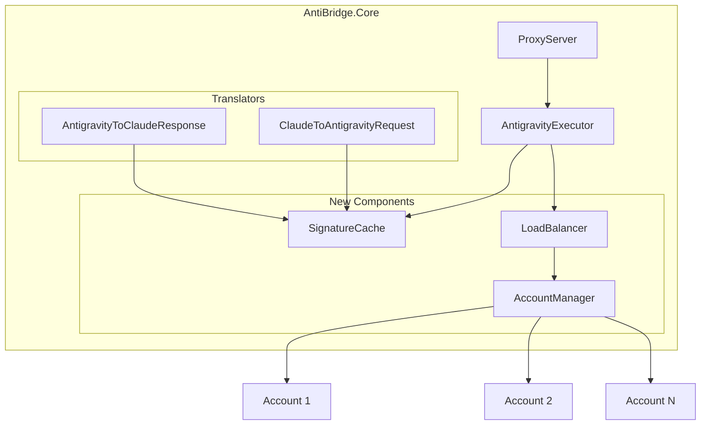
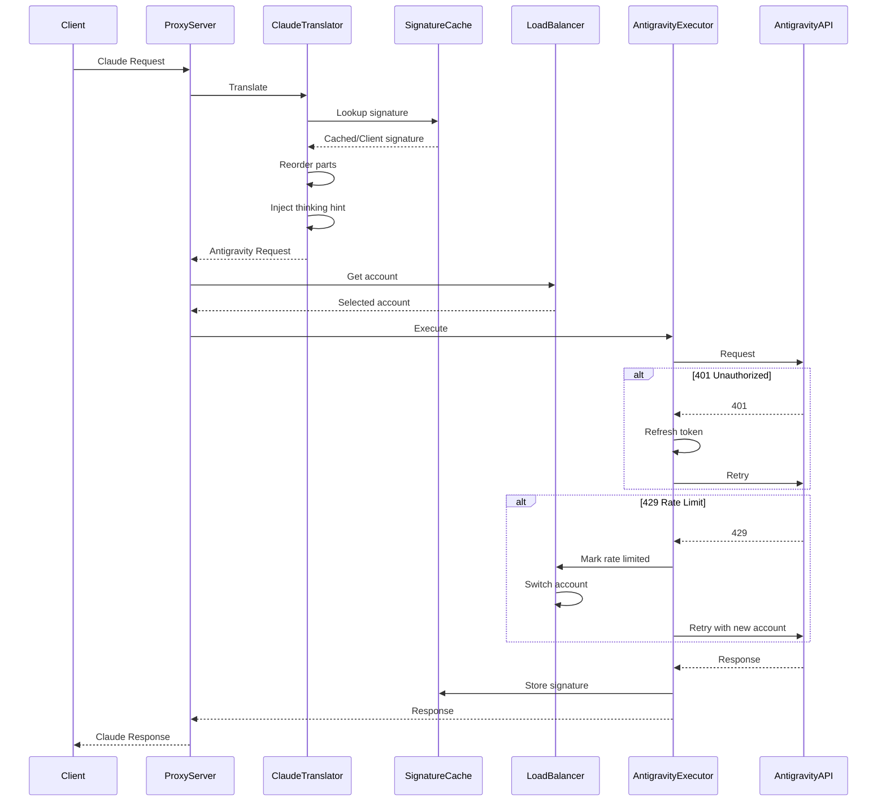

# Design Document: AntiBridge Advanced Features

## Tổng quan

Tài liệu này mô tả thiết kế kỹ thuật cho các tính năng nâng cao của AntiBridge proxy server. Các tính năng được thiết kế để tích hợp vào codebase hiện tại với minimal changes và đảm bảo backward compatibility.

## Kiến trúc

### Kiến trúc tổng thể



### Luồng xử lý Request với các tính năng mới



## Components và Interfaces

### 1. SignatureCache

```csharp
namespace AntiBridge.Core.Services;

/// <summary>
/// Cache for thought signatures to avoid validation errors
/// </summary>
public interface ISignatureCache
{
    /// <summary>
    /// Get cached signature for thinking text
    /// </summary>
    /// <param name="thinkingText">The thinking text to lookup</param>
    /// <returns>Cached signature or null if not found</returns>
    string? GetSignature(string thinkingText);
    
    /// <summary>
    /// Store signature for thinking text
    /// </summary>
    /// <param name="thinkingText">The thinking text</param>
    /// <param name="signature">The signature from Antigravity</param>
    void SetSignature(string thinkingText, string signature);
    
    /// <summary>
    /// Validate signature format
    /// </summary>
    /// <param name="signature">Signature to validate</param>
    /// <returns>True if valid format</returns>
    bool ValidateSignature(string signature);
    
    /// <summary>
    /// Clear expired entries
    /// </summary>
    void CleanupExpired();
}

public class SignatureCacheOptions
{
    /// <summary>
    /// Time-to-live for cache entries (default: 1 hour)
    /// </summary>
    public TimeSpan TTL { get; set; } = TimeSpan.FromHours(1);
    
    /// <summary>
    /// Maximum number of entries (default: 10000)
    /// </summary>
    public int MaxEntries { get; set; } = 10000;
    
    /// <summary>
    /// Cleanup interval (default: 5 minutes)
    /// </summary>
    public TimeSpan CleanupInterval { get; set; } = TimeSpan.FromMinutes(5);
}
```

### 2. LoadBalancer

```csharp
namespace AntiBridge.Core.Services;

/// <summary>
/// Load balancing strategy
/// </summary>
public enum LoadBalancingStrategy
{
    /// <summary>
    /// Distribute requests evenly across accounts
    /// </summary>
    RoundRobin,
    
    /// <summary>
    /// Use one account until rate limited, then switch
    /// </summary>
    FillFirst
}

/// <summary>
/// Account status for load balancing
/// </summary>
public class AccountStatus
{
    public string AccountId { get; set; } = "";
    public bool IsRateLimited { get; set; }
    public DateTime? RateLimitExpiry { get; set; }
    public bool IsQuotaExceeded { get; set; }
    public int RequestCount { get; set; }
    public DateTime LastUsed { get; set; }
}

/// <summary>
/// Load balancer for multi-account support
/// </summary>
public interface ILoadBalancer
{
    /// <summary>
    /// Get next available account
    /// </summary>
    /// <returns>Account or null if all rate limited</returns>
    Account? GetNextAccount();
    
    /// <summary>
    /// Mark account as rate limited
    /// </summary>
    /// <param name="accountId">Account ID</param>
    /// <param name="retryAfter">Optional retry-after duration</param>
    void MarkRateLimited(string accountId, TimeSpan? retryAfter = null);
    
    /// <summary>
    /// Mark account as quota exceeded
    /// </summary>
    /// <param name="accountId">Account ID</param>
    void MarkQuotaExceeded(string accountId);
    
    /// <summary>
    /// Get status of all accounts
    /// </summary>
    IReadOnlyList<AccountStatus> GetAccountStatuses();
    
    /// <summary>
    /// Reset rate limit status for account
    /// </summary>
    /// <param name="accountId">Account ID</param>
    void ResetRateLimit(string accountId);
}

public class LoadBalancerOptions
{
    /// <summary>
    /// Load balancing strategy
    /// </summary>
    public LoadBalancingStrategy Strategy { get; set; } = LoadBalancingStrategy.RoundRobin;
    
    /// <summary>
    /// Default rate limit duration if not specified by API
    /// </summary>
    public TimeSpan DefaultRateLimitDuration { get; set; } = TimeSpan.FromMinutes(1);
}
```

### 3. Enhanced AntigravityExecutor

```csharp
// Additions to existing AntigravityExecutor

public class RetryOptions
{
    /// <summary>
    /// Maximum retry attempts for 401 errors
    /// </summary>
    public int MaxAuthRetries { get; set; } = 1;
    
    /// <summary>
    /// Enable automatic token refresh on 401
    /// </summary>
    public bool AutoRefreshToken { get; set; } = true;
}
```

### 4. Enhanced ClaudeToAntigravityRequest

```csharp
// Additions to existing ClaudeToAntigravityRequest

public class TranslationOptions
{
    /// <summary>
    /// Enable parts reordering (thinking blocks first)
    /// </summary>
    public bool ReorderParts { get; set; } = true;
    
    /// <summary>
    /// Enable interleaved thinking hint injection
    /// </summary>
    public bool InjectThinkingHint { get; set; } = true;
    
    /// <summary>
    /// Signature cache instance
    /// </summary>
    public ISignatureCache? SignatureCache { get; set; }
}

public static class InterleavedThinkingHint
{
    public const string HintText = "Interleaved thinking is enabled. You may think between tool calls to reflect on tool outputs before proceeding.";
}
```

## Data Models

### SignatureCacheEntry

```csharp
namespace AntiBridge.Core.Models;

/// <summary>
/// Entry in the signature cache
/// </summary>
public class SignatureCacheEntry
{
    /// <summary>
    /// SHA256 hash of thinking text (cache key)
    /// </summary>
    public string TextHash { get; set; } = "";
    
    /// <summary>
    /// The cached signature
    /// </summary>
    public string Signature { get; set; } = "";
    
    /// <summary>
    /// When this entry was created
    /// </summary>
    public DateTime CreatedAt { get; set; }
    
    /// <summary>
    /// When this entry expires
    /// </summary>
    public DateTime ExpiresAt { get; set; }
}
```

### AccountRateLimitInfo

```csharp
namespace AntiBridge.Core.Models;

/// <summary>
/// Rate limit information for an account
/// </summary>
public class AccountRateLimitInfo
{
    public string AccountId { get; set; } = "";
    public bool IsRateLimited { get; set; }
    public DateTime? RateLimitStarted { get; set; }
    public DateTime? RateLimitExpiry { get; set; }
    public bool IsQuotaExceeded { get; set; }
    public string? ErrorMessage { get; set; }
}
```


## Correctness Properties

*Một property là một đặc tính hoặc hành vi phải đúng trong mọi trường hợp thực thi hợp lệ của hệ thống - về cơ bản là một phát biểu formal về những gì hệ thống phải làm. Properties là cầu nối giữa specifications dễ đọc và correctness guarantees có thể verify bằng máy.*

### Property 1: Signature Cache Round-Trip

*For any* thinking text và signature hợp lệ, nếu signature được lưu vào cache với thinking text đó, thì lookup với cùng thinking text phải trả về cùng signature.

**Validates: Requirements 1.1, 1.7**

### Property 2: Cache Lookup Priority

*For any* thinking block với client signature, nếu cache chứa signature cho thinking text đó, output phải sử dụng cached signature; nếu cache không chứa, output phải sử dụng client signature.

**Validates: Requirements 1.2, 1.3, 1.4**

### Property 3: Signature Validation

*For any* signature string, validation function phải trả về true nếu và chỉ nếu signature có format hợp lệ (non-empty, contains expected prefix pattern).

**Validates: Requirements 1.5**

### Property 4: Cache TTL Expiration

*For any* cache với entries có timestamps khác nhau, sau khi cleanup được trigger, chỉ entries có age nhỏ hơn TTL mới còn trong cache.

**Validates: Requirements 1.6**

### Property 5: 401 Retry with Token Refresh

*For any* request gặp 401 Unauthorized, hệ thống phải refresh token và retry đúng 1 lần. Nếu retry vẫn 401 hoặc refresh fail, phải trả error về client.

**Validates: Requirements 2.1, 2.2, 2.3, 2.4, 2.5**

### Property 6: Parts Stable Partitioning

*For any* message với role "model" chứa mixed parts (thinking và non-thinking), sau khi reorder: (1) tất cả thinking blocks phải ở trước tất cả non-thinking parts, (2) thứ tự tương đối của thinking blocks với nhau được giữ nguyên, (3) thứ tự tương đối của non-thinking parts với nhau được giữ nguyên.

**Validates: Requirements 3.1, 3.2, 3.3**

### Property 7: Interleaved Thinking Hint Injection

*For any* request, hint được inject vào system instruction nếu và chỉ nếu request có cả tools và thinking enabled. Khi inject, hint phải ở cuối system instruction parts.

**Validates: Requirements 4.1, 4.3, 4.4**

### Property 8: Load Balancer Distribution

*For any* sequence of N requests với M available accounts (M > 1), với round-robin strategy: mỗi account nhận xấp xỉ N/M requests; với fill-first strategy: account đầu tiên nhận requests cho đến khi rate limited.

**Validates: Requirements 5.1, 5.2**

### Property 9: Load Balancer Failover

*For any* request gặp 429 hoặc quota exceeded error, nếu còn account available khác, hệ thống phải switch sang account đó và retry. Nếu tất cả accounts đều unavailable, phải trả 429 về client.

**Validates: Requirements 5.3, 5.4, 5.5**

### Property 10: Load Balancer Recovery

*For any* account bị rate limited với expiry time, sau khi expiry time qua, account phải available trở lại trong pool.

**Validates: Requirements 5.6, 5.7**

## Error Handling

### Signature Cache Errors

| Error | Handling |
|-------|----------|
| Cache full | Evict oldest entries (LRU) |
| Invalid signature format | Log warning, skip caching |
| Hash computation failure | Fallback to client signature |

### Authentication Errors

| Error | Handling |
|-------|----------|
| 401 Unauthorized | Refresh token, retry once |
| Refresh token expired | Return 401 to client |
| Refresh token invalid | Return 401 to client |

### Load Balancing Errors

| Error | Handling |
|-------|----------|
| 429 Too Many Requests | Mark account rate limited, switch account |
| Quota exceeded | Mark account quota exceeded, switch account |
| All accounts unavailable | Return 429 to client with retry-after |
| No accounts configured | Return 503 Service Unavailable |

## Testing Strategy

### Unit Tests

Unit tests sẽ cover các specific examples và edge cases:

1. **SignatureCache**
   - Empty cache lookup returns null
   - Store and retrieve signature
   - TTL expiration
   - Max entries eviction
   - Invalid signature rejection

2. **LoadBalancer**
   - Single account always selected
   - Round-robin distribution
   - Fill-first distribution
   - Rate limit marking and recovery
   - All accounts exhausted

3. **ClaudeToAntigravityRequest**
   - Parts reordering with no thinking blocks
   - Parts reordering with only thinking blocks
   - Hint injection with tools only
   - Hint injection with thinking only

### Property-Based Tests

Property tests sẽ verify universal properties với random inputs. Sử dụng thư viện **FsCheck** cho C#.

Mỗi property test phải:
- Chạy tối thiểu 100 iterations
- Reference property number từ design document
- Tag format: **Feature: antibridge-advanced-features, Property N: [property text]**

**Property Test Configuration:**
```csharp
// FsCheck configuration
var config = Configuration.Default
    .WithMaxNbOfTest(100)
    .WithStartSize(10)
    .WithEndSize(100);
```

**Test Organization:**
- `SignatureCachePropertyTests.cs` - Properties 1-4
- `RetryHandlerPropertyTests.cs` - Property 5
- `PartsReorderingPropertyTests.cs` - Property 6
- `ThinkingHintPropertyTests.cs` - Property 7
- `LoadBalancerPropertyTests.cs` - Properties 8-10
