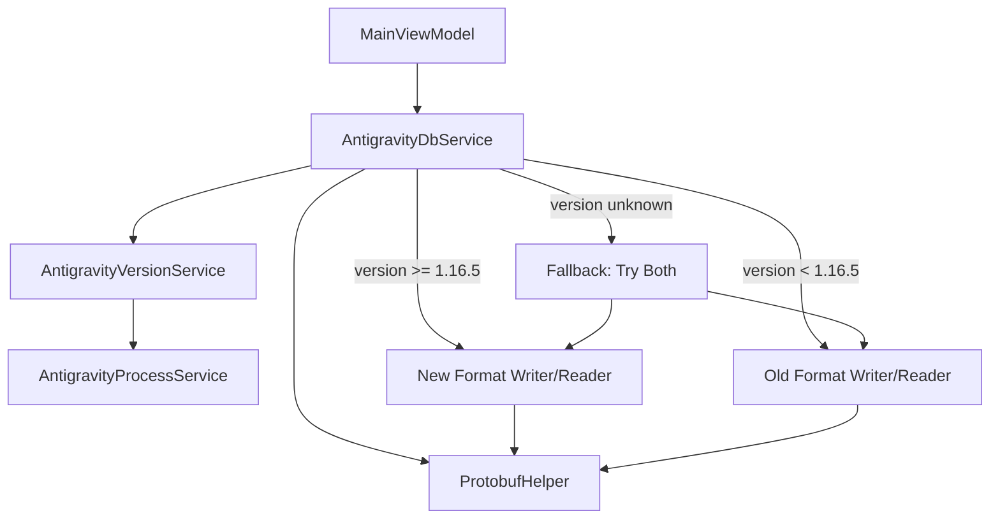

# Tài liệu Thiết kế: Hỗ trợ định dạng token mới Antigravity

## Tổng quan

Thiết kế này mở rộng AntiBridge.Avalonia để hỗ trợ cả định dạng token cũ (< 1.16.5) và mới (>= 1.16.5) của Antigravity IDE. Thay đổi chính bao gồm:

1. Tạo service mới `AntigravityVersionService` để phát hiện phiên bản Antigravity trên mọi nền tảng
2. Mở rộng `ProtobufHelper` với các hàm helper mới cho New_Format
3. Cập nhật `AntigravityDbService` để phân nhánh logic ghi/đọc token dựa trên phiên bản
4. Tái sử dụng `AntigravityProcessService` cho việc tìm đường dẫn file thực thi

Logic được port trung thành từ reference implementation Rust trong Antigravity-Manager.

## Kiến trúc



Luồng xử lý khi Sync To Antigravity:
1. `AntigravityDbService.InjectTokenToAntigravity()` được gọi
2. Gọi `AntigravityVersionService.GetAntigravityVersion()` để phát hiện phiên bản
3. Nếu phiên bản >= 1.16.5 → gọi `InjectNewFormat()`
4. Nếu phiên bản < 1.16.5 → gọi `InjectOldFormat()` (logic hiện tại)
5. Nếu không phát hiện được → gọi cả hai, thành công nếu ít nhất một thành công

Luồng xử lý khi Import From Antigravity:
1. `AntigravityDbService.ReadTokenFromAntigravity()` được gọi
2. Thử đọc từ key New_Format trước
3. Nếu thất bại → thử đọc từ key Old_Format
4. Trả về token đầu tiên tìm được

## Thành phần và Giao diện

### AntigravityVersionService (MỚI)

```csharp
// File: src/AntiBridge.Core/Services/AntigravityVersionService.cs
namespace AntiBridge.Core.Services;

public class AntigravityVersionService
{
    /// <summary>
    /// Kết quả phát hiện phiên bản
    /// </summary>
    public record VersionResult(string Version, bool IsNewFormat);

    /// <summary>
    /// Phát hiện phiên bản Antigravity IDE.
    /// Trả về null nếu không phát hiện được.
    /// </summary>
    public VersionResult? GetAntigravityVersion();

    /// <summary>
    /// So sánh hai chuỗi phiên bản semantic versioning.
    /// Trả về: >0 nếu v1 > v2, 0 nếu bằng, <0 nếu v1 < v2.
    /// </summary>
    public static int CompareVersions(string v1, string v2);

    /// <summary>
    /// Kiểm tra phiên bản có phải New_Format không (>= 1.16.5).
    /// </summary>
    public static bool IsNewVersion(string version);
}
```

Platform-specific logic:
- **Windows**: Chạy PowerShell `(Get-Item 'path').VersionInfo.FileVersion`
- **macOS**: Đọc `Info.plist` từ `.app` bundle, parse XML lấy `CFBundleShortVersionString`
- **Linux**: Chạy `antigravity --version` hoặc đọc `resources/app/package.json`

### ProtobufHelper (MỞ RỘNG)

```csharp
// Thêm vào file hiện tại: src/AntiBridge.Core/Services/ProtobufHelper.cs
public static class ProtobufHelper
{
    // ... các hàm hiện tại giữ nguyên ...

    /// <summary>
    /// Tạo OAuthTokenInfo message KHÔNG bao gồm wrapper Field 6.
    /// Dùng cho New_Format nơi OAuthTokenInfo được base64 encode riêng.
    /// </summary>
    public static byte[] CreateOAuthInfo(
        string accessToken, string refreshToken, long expiryTimestamp);

    /// <summary>
    /// Mã hóa chuỗi thành protobuf string field (wire_type = 2).
    /// Public version của CreateStringField hiện tại.
    /// </summary>
    public static byte[] EncodeStringField(int fieldNum, string value);

    /// <summary>
    /// Mã hóa mảng byte thành protobuf length-delimited field (wire_type = 2).
    /// Public version của CreateBytesField hiện tại.
    /// </summary>
    public static byte[] EncodeLenDelimField(int fieldNum, byte[] value);
}
```

`CreateOAuthInfo` tạo cùng cấu trúc OAuthTokenInfo như `CreateOAuthField` nhưng không wrap trong Field 6. Cụ thể: Field 1 (access_token) + Field 2 ("Bearer") + Field 3 (refresh_token) + Field 4 (Timestamp{seconds}).

### AntigravityDbService (CẬP NHẬT)

```csharp
// File hiện tại: src/AntiBridge.Core/Services/AntigravityDbService.cs
public class AntigravityDbService
{
    private const string OldStateKey = "jetskiStateSync.agentManagerInitState";
    private const string NewOAuthKey = "antigravityUnifiedStateSync.oauthToken";
    private const string OnboardingKey = "antigravityOnboarding";

    private readonly AntigravityVersionService _versionService;

    /// <summary>
    /// Inject token - phân nhánh theo phiên bản Antigravity.
    /// </summary>
    public bool InjectTokenToAntigravity(TokenData token);

    /// <summary>
    /// Đọc token - thử New_Format trước, fallback sang Old_Format.
    /// </summary>
    public TokenData? ReadTokenFromAntigravity();

    // Private methods
    private bool InjectNewFormat(string dbPath, TokenData token);
    private bool InjectOldFormat(string dbPath, TokenData token);
    private TokenData? ReadNewFormat(SqliteConnection connection);
    private TokenData? ReadOldFormat(SqliteConnection connection);
}
```

### AntigravityProcessService (CẬP NHẬT NHỎ)

Phương thức `GetAntigravityPath()` hiện tại là `private static`. Cần đổi thành `public static` để `AntigravityVersionService` có thể sử dụng, hoặc tạo phương thức public wrapper `GetAntigravityExecutablePath()`.

## Mô hình Dữ liệu

### Cấu trúc New_Format trong database

```
Key: "antigravityUnifiedStateSync.oauthToken"
Value: base64(OuterMessage)

OuterMessage (protobuf):
  Field 1 (len-delim): InnerMessage
    Field 1 (string): "oauthTokenInfoSentinelKey"
    Field 2 (len-delim): InnerMessage2
      Field 1 (string): base64(OAuthTokenInfo)

OAuthTokenInfo (protobuf, encoded as binary then base64):
  Field 1 (string): access_token
  Field 2 (string): "Bearer"
  Field 3 (string): refresh_token
  Field 4 (len-delim): Timestamp
    Field 1 (varint): unix_seconds
```

### Cấu trúc Old_Format trong database (không thay đổi)

```
Key: "jetskiStateSync.agentManagerInitState"
Value: base64(StateBlob)

StateBlob (protobuf):
  Field 1 (string): user_id (bị xóa khi inject)
  Field 2 (string): email
  Field 6 (len-delim): OAuthTokenInfo
    Field 1 (string): access_token
    Field 2 (string): "Bearer"
    Field 3 (string): refresh_token
    Field 4 (len-delim): Timestamp
      Field 1 (varint): unix_seconds
```

### VersionResult record

```csharp
public record VersionResult(string Version, bool IsNewFormat);
```

- `Version`: Chuỗi phiên bản (ví dụ: "1.16.5")
- `IsNewFormat`: `true` nếu version >= 1.16.5


## Thuộc tính Đúng đắn (Correctness Properties)

*Một thuộc tính (property) là một đặc điểm hoặc hành vi phải đúng trong mọi lần thực thi hợp lệ của hệ thống — về cơ bản là một phát biểu hình thức về những gì hệ thống phải làm. Các thuộc tính đóng vai trò cầu nối giữa đặc tả dễ đọc cho con người và đảm bảo đúng đắn có thể kiểm chứng bằng máy.*

### Property 1: Version comparison correctness

*For any* chuỗi phiên bản hợp lệ (major.minor.patch), `IsNewVersion` phải trả về `true` khi và chỉ khi phiên bản đó >= 1.16.5, và `false` trong trường hợp ngược lại.

**Validates: Requirements 2.1, 2.2**

### Property 2: Version comparison antisymmetry

*For any* hai chuỗi phiên bản v1 và v2, `CompareVersions(v1, v2)` phải trả về giá trị ngược dấu với `CompareVersions(v2, v1)`. Cụ thể: `sign(CompareVersions(v1, v2)) == -sign(CompareVersions(v2, v1))`.

**Validates: Requirements 2.3**

### Property 3: New_Format encode/decode round-trip

*For any* bộ (access_token, refresh_token, expiry_timestamp) hợp lệ, việc mã hóa theo cấu trúc New_Format (OuterMessage → InnerMessage → base64(OAuthTokenInfo)) rồi giải mã ngược lại phải trả về đúng access_token và refresh_token ban đầu.

**Validates: Requirements 3.2, 6.3**

### Property 4: CreateOAuthInfo structure correctness

*For any* bộ (access_token, refresh_token, expiry_timestamp), output của `CreateOAuthInfo` phải chứa Field 1 (access_token gốc), Field 2 ("Bearer"), Field 3 (refresh_token gốc), Field 4 (timestamp), và KHÔNG chứa Field 6 wrapper.

**Validates: Requirements 3.3, 7.1**

### Property 5: Old_Format inject field manipulation

*For any* protobuf blob hợp lệ chứa Field 1, Field 2, và Field 6, sau khi xóa Field 1, Field 2, Field 6 rồi thêm Field 6 mới, kết quả phải KHÔNG chứa Field 1, KHÔNG chứa Field 2, và chứa đúng Field 6 mới với token đã cho.

**Validates: Requirements 4.2**

### Property 6: EncodeStringField round-trip

*For any* chuỗi UTF-8 hợp lệ và field number, mã hóa bằng `EncodeStringField` rồi giải mã bằng `FindField` phải trả về đúng chuỗi gốc.

**Validates: Requirements 7.2, 7.4**

### Property 7: EncodeLenDelimField round-trip

*For any* mảng byte và field number, mã hóa bằng `EncodeLenDelimField` rồi giải mã bằng `FindField` phải trả về đúng mảng byte gốc.

**Validates: Requirements 7.3, 7.5**

## Xử lý Lỗi

| Tình huống | Xử lý |
|---|---|
| Không tìm thấy file thực thi Antigravity | `AntigravityVersionService.GetAntigravityVersion()` trả về `null`, trigger fallback mode |
| PowerShell/command thất bại khi đọc version | Trả về `null`, trigger fallback mode |
| Phiên bản không parse được (format lạ) | Trả về `null`, trigger fallback mode |
| Database không tồn tại | `GetDbPath()` trả về `null`, báo lỗi "Antigravity database not found" |
| Key Old_Format không tồn tại khi inject old format | Báo lỗi "No existing state - please login to Antigravity first" |
| Key New_Format không tồn tại khi đọc | Fallback sang đọc Old_Format |
| Cả hai key đều không có dữ liệu khi đọc | Báo lỗi "No login data found in Antigravity" |
| Base64 decode thất bại | Báo lỗi cụ thể, thử format còn lại nếu đang trong fallback mode |
| Protobuf parse thất bại | Báo lỗi cụ thể, thử format còn lại nếu đang trong fallback mode |
| Cả hai format đều thất bại trong fallback | Báo lỗi tổng hợp chi tiết lỗi của từng format |

## Chiến lược Testing

### Framework và Thư viện

- **Unit tests**: NUnit 3 (đã có trong project)
- **Property-based tests**: FsCheck + FsCheck.NUnit (đã có trong project)
- **Cấu hình PBT**: Mỗi property test chạy tối thiểu 100 iterations

### Unit Tests

Tập trung vào:
- Integration tests với SQLite in-memory database cho inject/read flows
- Edge cases: database không tồn tại, key không tồn tại, dữ liệu corrupt
- Fallback behavior: version detection thất bại → thử cả hai format
- Platform-specific version detection (mock process execution)

### Property-Based Tests

Mỗi property test phải:
- Reference đúng property number từ design document
- Chạy tối thiểu 100 iterations
- Sử dụng FsCheck generators cho random token data
- Tag format: **Feature: antigravity-new-format-support, Property {N}: {title}**

Danh sách property tests:
1. **Property 1**: Generate random version strings, verify `IsNewVersion` correctness
2. **Property 2**: Generate random version pairs, verify antisymmetry of `CompareVersions`
3. **Property 3**: Generate random token tuples, verify New_Format encode/decode round-trip
4. **Property 4**: Generate random token tuples, verify `CreateOAuthInfo` structure
5. **Property 5**: Generate random protobuf blobs with fields 1,2,6, verify field manipulation
6. **Property 6**: Generate random strings + field numbers, verify `EncodeStringField` round-trip
7. **Property 7**: Generate random byte arrays + field numbers, verify `EncodeLenDelimField` round-trip
